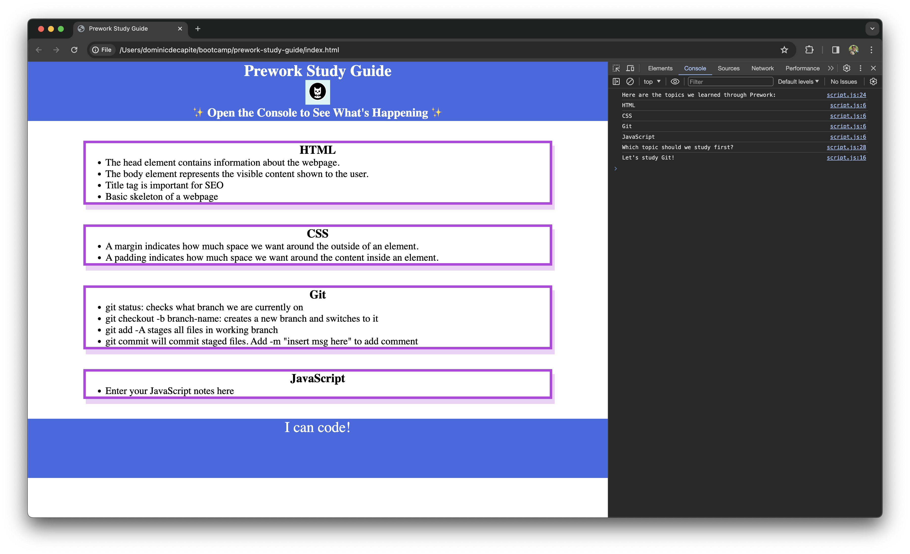

# Prework Study Guide

## Description

This study guide is to provide guidance for students going through the full stack coding bootcamp. It includes notes on HTML, CSS, JavaScript, and Git

## Installation

N/A

## Usage

To use the study guide, reference the notes given for each section. For recommendations on what to study, open ChromeDevTools by pressing Command+Option+I (macOS) or Control+Shift+I (Windows). A console window will open, if done correctly. From there, yoou will be able to see a list of topics we studied, along with a recommendation on what to study next.

## Credits

N/A

## License

Please refer to the LICENSE in the repo.

